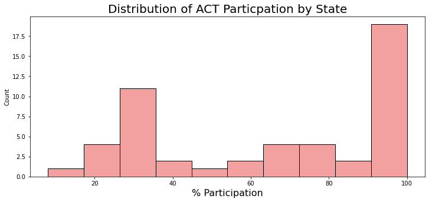
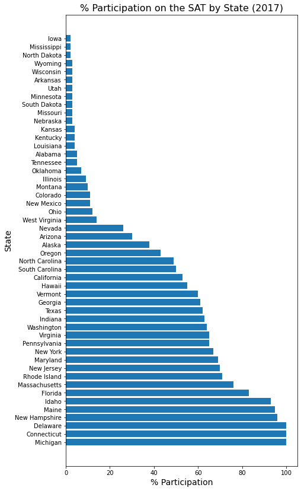
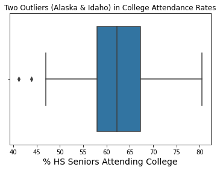

# The Impact of the ACT/SAT-Decision on Students Continuing to Higher Education
##### Author: Michael Riedeman

---

### Executive Summary

#### Problem Statement

Deciding whether to take the ACT or SAT as a high school student is just one of the many decisions students make at such a pivotal point in their life. But does the decision matter? 
The purpose of these standardized tests is to "gauge readiness for college" ([*source*](https://www.usnews.com/education/best-colleges/articles/act-vs-sat-how-to-decide-which-test-to-take)), so this study determines whether students who take the ACT or SAT have higher attendance rates in college. Here, standardized test data for both exams in 2017 was analyzed with the percentage of high school seniors that attended college the next fall in 2018.

Data was collected for high school students in each US state. Analysis in this study focused primarily on the participation rates, test scores, and the percent of students that attended college the following year. This study was viewed in the perspective of the student; does one test boast better efficacy over the other in getting students into college? Let's find out! 

#### Data Description

 

 

 

---

### Data Dictionary

|       ACT Data        |                                                                       |
|:--------------|:-----------------------------------------------------------------------|
| State         | US State                                                               |
| Participation | The percent of eligible high school students that took the ACT.         |
| Composite     | The sum of the scores for all sections on the ACT. The max score is 35 |
|                                                                                       
|      **SAT Data**|
| State                              | US State                                                                                                                       |
| Participation                      | The percent of high school students that took the SAT.                                                                         |
| Evidence-Based_Reading_and_Writing | The sum of the scores for the reading and writing sections of the SAT. The sum of the two sections are scored between 400-1600 |
| Math                               | The score representing the Math section on the SAT. Scores can range from 200-800.                                              |
| Total                              | The sum of the Evidence-Based_Reading_and_Writing and Math scores.                                                     |
|                     |
|**College Attendance Data**||
| State               | US State                                                                              |
| attending_college   | Percent of high school graduates going directly to college (%)                        |
| projected_graduates | Projected high school graduates - 2018                                                |
| college_enrollment  | First-time freshmen directly from high school enrolled anywhere in the US - Fall 2018 |

### Primary Findings
---
**ACT**

States tend to be either largely supportive or unsupportive  of taking the ACT. This is most likely due the presence or absence of state sponsored funding for students to take the exam. However, there are about 12 states that do not share data points near the min and max of the range. These states can seen loosley following a negative correlation on the correlation plot of ACT participation and composite scores above.

States with high participation rates on the ACT tend to have much lower composite scores and the opposite is true for states with low participation rates. Requiring all students to take the ACT will certainly bring down average scores compared to the select few students in low participating states that are likely high achievers and seeking competitive schools. This is dicussed further in the *Recommendations* section below.

**SAT**

The plots above were used to analyze the trends for SAT data in 2017. The participation rate on the SAT by state estimates an inverted normal distribution (states tend to have either very high or very low participation rates). States-administered tests are likely in the three states with 100% participation rates (Delaware, Connecticut, Michigan). See the link below for the updated list of States that required the SAT. There is a steep decline in participation on the SAT around the median of the data. States appear to vehemently oppose the SAT compared to the more gradual decline of participation in the ACT.

The SAT score data, while scored differently than the ACT, has a comparable negative correlation value of -0.86 (-.84 for ACT) with percent participation. The same hypothesis will be used here that used for the ACT: "lower participating states' scores are higher due to type of student likely to take the test in their respective state".

**College Attendance**

College attendance data for the Fall of 2018 was investigated to determine if students were more likely to attend college based on the standardized test they chose to take. The national average for high school schools to attend college immediately after high school was 62.3% in 2018. The median of 62.2% was remarkably close to the mean, supporting the normal distribution. The boxplot above indicated two outliers in the college attendance data (Alaska and Idaho). Both outlier's posted rates approximately 20% below national average. Further discussion on these outliers can be viewed in the *Recommendations* section below.

### Conclusion
---

Participation data for the ACT and SAT was correlated with a state's high school students of 2017 attending college in Fall 2018. College freshman attendance rates by state had -0.1 correlation for ACT participation and 0.14 for SAT respectively. This indicates that there was little to no correlation between the standardized test students chose to take (or state's preferred exam) with college attendance. This can be understood visually by examining the states with highest college attendance rates in the table above. The top two states posting the highest college attendance rates (Mississippi and Connecticut) have inverse participation rates for the ACT and SAT. The data does not suggest a state's decision of a particular standardized test is the contributing factor for state by state college attendance fluctuations. Potential factors affecting student's ability or choice to attend college will be discussed in the *Recommendations* section.

### Recommendations
---

If a state's choice of standardized test is not a contributing factor for college attendance rates, then what factors may be significant? Shawn Lea Temple's disertation *Factors that Influence Students' Desires to Attend Higher Education* (2009) provides some insight. She states "There were six main reasons that students did not continue their education: socioeconmic status, cultural and social capital, family structure and expectations, financial reasons and the general organization of the high school." While her study was primarily qualitative, there are quantitative data that could be collected for further analysis.

It is recommended college tuition rates, local job markets, and K-12 public school funding data be collected and correlated with college attendance rates. It is probable college tuition rates are a contributing factor, as students may be less willing to incur the large amount of debt required to obtain a degree in the 21st century. If local job markets don't require college education to make a good living, then student's could be uninspired by the prospects of getting a college degree. K-12 public school funding could affect a student's ability to be eligble for college level difficulty, and poorly funded schools could be demotivating for students. There are countless parameters affecting a students ability to attend college, but examination of these recommended factors could prove some factors are more important than others.

### Provided Data
---

* [`college_attendance_2018.csv`](./data/college_attendance_2018.csv): 2018 College Attendance Rates by State ([source](http://www.higheredinfo.org/dbrowser/index.php?submeasure=63&year=2018&level=nation&mode=data&state=))
* [`act_2017.csv`](./data/act_2017.csv): 2017 ACT Scores by State ([source](https://blog.prepscholar.com/act-scores-by-state-averages-highs-and-lows))
* [`act_2018.csv`](./data/act_2018.csv): 2018 ACT Scores by State ([source](https://blog.prepscholar.com/act-scores-by-state-averages-highs-and-lows))
* [`act_2019.csv`](./data/act_2019.csv): 2019 ACT Scores by State ([source](https://blog.prepscholar.com/act-scores-by-state-averages-highs-and-lows))
* [`act_2019_ca.csv`](./data/act_2019_ca.csv): 2019 ACT Scores in California by School ([source](https://www.cde.ca.gov/ds/sp/ai/) | [data dictionary](https://www.cde.ca.gov/ds/sp/ai/reclayoutact19.asp))
* [`sat_2017.csv`](./data/sat_2017.csv): 2017 SAT Scores by State ([source](https://blog.collegevine.com/here-are-the-average-sat-scores-by-state/))
* [`sat_2018.csv`](./data/sat_2018.csv): 2018 SAT Scores by State ([source](https://blog.collegevine.com/here-are-the-average-sat-scores-by-state/))
* [`sat_2019.csv`](./data/sat_2019.csv): 2019 SAT Scores by State ([source](https://blog.prepscholar.com/average-sat-scores-by-state-most-recent))
* [`sat_2019_by_intended_college_major.csv`](./data/sat_2019_by_intended_college_major.csv): 2019 SAT Scores by Intended College Major ([source](https://reports.collegeboard.org/pdf/2019-total-group-sat-suite-assessments-annual-report.pdf))
* [`sat_2019_ca.csv`](./data/sat_2019_ca.csv): 2019 SAT Scores in California by School ([source](https://www.cde.ca.gov/ds/sp/ai/) | [data dictionary](https://www.cde.ca.gov/ds/sp/ai/reclayoutsat19.asp))
* [`sat_act_by_college.csv`](./data/sat_act_by_college.csv): Ranges of Accepted ACT & SAT Student Scores by Colleges ([source](https://www.compassprep.com/college-profiles/))

### Sources
---
1. The purpose of standardized tests:

https://www.usnews.com/education/best-colleges/articles/act-vs-sat-how-to-decide-which-test-to-take

2. Title Image

https://ampla-edu.com/sat-vs-act-which-one-to-take/

3. A heatmap that demonstrates the higher density of farmers in the midwest region.

http://www.slate.com/articles/technology/future_tense/2012/06/a_map_of_farmers_in_the_u_s_and_world_.html?query=Hillary%20Clinton,%20Donald%20Trump&view=histogram

4. An updated list of states that require the SAT/ACT. 

https://www.testive.com/state-sat-act/

5. College attendance data:

http://www.higheredinfo.org/dbrowser/index.phpsubmeasure=63&year=2018&level=nation&mode=data&state= 

6. *Factors that Influence Student's Desires to Attend College* (Dissertation by Shawn Lea Temple)

https://scholarship.shu.edu/cgi/viewcontent.cgi?article=1420&context=dissertations