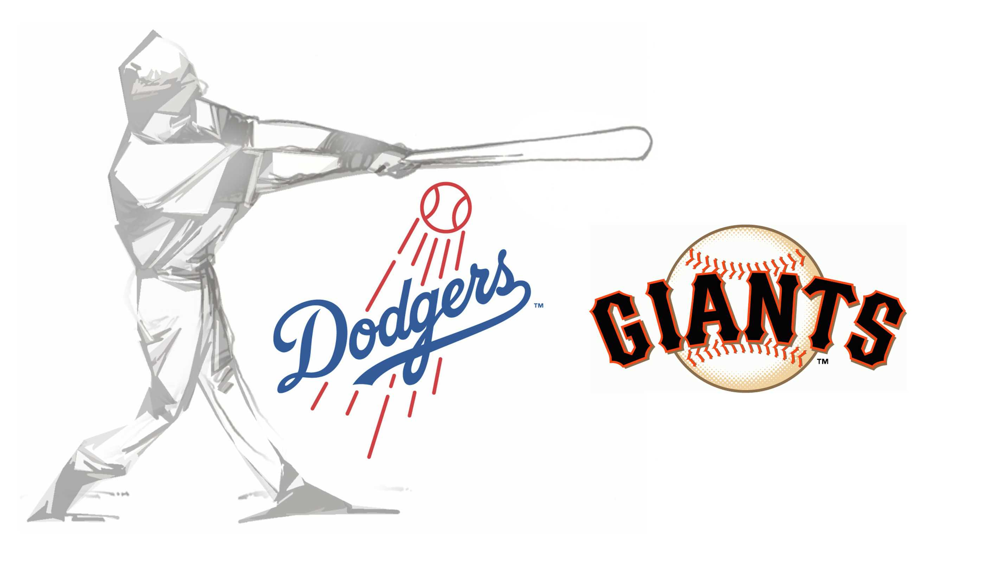
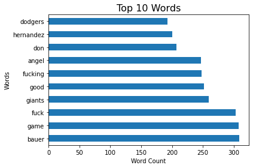
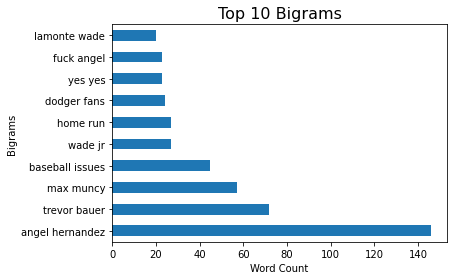
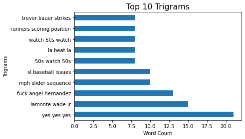
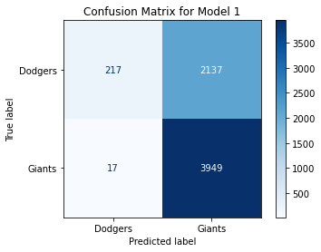
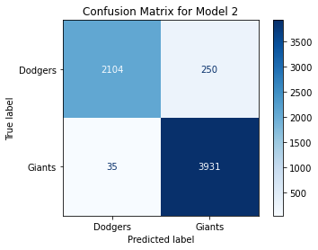
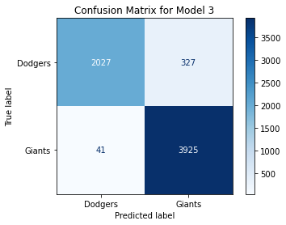
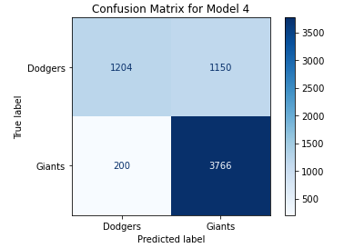

# Binary Classification Models with NLP, a look at the Giants-Dodgers Rivalry
##### Author: Michael Riedeman

---

### Problem Statement

Reddit is a popular social media site comprised of "subreddits"; internet communities that discuss a particular topic. Two of these internet communities were chosen (r/Dodgers and r/SFGiants) to test the efficacy of binary classifcation algorithms with natural language processing. The goal of this project was to classify the source of the subreddit through only the users' comments. The corpus of this data was collected from the game thread's for each team. A game thread is where fans post comments and interact with each other while watching the game. The context for the comments was the two team's June 28th matchup against eachother in Dodger Stadium. The starting pitchers were Anthony DeSclafani (8-2, 2.77 ERA) and Trevor Bauer (7-5, 2.57 ERA). The Dodgers defeated the Giants 3-2, cutting the Giants lead in the division to 2.5 games. By the end of the game the Giants game-thread comprised of 3966 comments and the Dodger game-thread comprised of 2353 comments. Therefore, the corpus fed to the model contained 6319 comments with a mild class imbalance and a baseline model of 62.8%. 

### Data Description
---

 

 

 

### Data Dictionary
---

The datasets used to create the model were obtained from Reddit.

Giants Game Thread: ([*source*](https://www.reddit.com/r/SFGiants/comments/o9hxxu/gameday_thread_62821_giants_desclafani_dodgers/)). 

Dodgers Game Thread: ([*source*](https://www.reddit.com/r/Dodgers/comments/o9xssr/game_chat_628_giants_5027_dodgers_4731_710_pm/)).

|  **Data Dictionary**             |                      |
|:--------------|:---------------------------------------------------------------|
| Team  | The team's subreddit where the comment was sourced   |
| Comment    | A Reddit user's comment collected from either game thread |

### Model Performance and Primary Findings

---
    
Four models were developed to maximize the classification accuracy of comments from either the r/Dodgers or r/SFGiants subreddits. The first model utilized Count Vectorizer to convert the corpus into a sparse matrix and utilized the default english stop words. Additionaly, more stop words were added such as urls and bot spam to reduce noise from the model. Bigrams and trigrams were also added to assist the model in developing potential correlations of phrases. The Random Forest Classifier was then used along with a grid search to pinpoint the optimal hyperparameters. The best Random Forest model had an accuracy of 65.7% and had a max depth of 2, minimum sample split of 3, and the number of estimators was 75. This was only a marginal increase of 2.9% over the baseline model.

The second model included the same Count Vectorizer approach as the first, but used Logistic Regression as its binary classification model instead of Random Forest. Two regularization methods ('l1' and 'l2') were used in the grid search.The best model had an accuracy of 69.5% and used the 'l2' regularization penalty. This was an improvment over the previous model, but still not a significant increase over the baseline model.

The third model used Count Vectorizer as well, but replaced Logistic Regression with Naive Bayes and produced the best accuracy of all models at 69.8%. The default hyperparameters were used in the Naive Bayes model.

The fourth model tested the TfidfVectorizer to see its impact on accuracy over Count Vectorizer. An additional hyperparameter of min_df was used and grid searched over 1, 2, 3 to determine if filtering words that appeared less than multiple times improved accuracy. Logistic Regression was then applied, producing an accuracy of 69.5% which was the same as the second model. 

### Conclusions
---

Overall, model 3 produced the best results with a 7.0% increase in classification accuracy over the baseline model. Modeling this corpus was challenging because the context of the comments were discussing the same game, just from different perspectives. Therefore, players on both teams were mentioned consistently from both threads, which didn't allow the player names to assist the classifcation model's ability in predicting the source of the comment.

### Recommendations
---

The similarities of the subreddits made it difficult for models to classify with significant accuracy over the baseline. These models would benefit from sentiment analysis to determine what team the user's comment suggests they want to win. Additionaly, longer ngrams could be used to identify inside-jokes within the subreddits.

### Sources
---

1. Giants Game Thread: ([*source*](https://www.reddit.com/r/SFGiants/comments/o9hxxu/gameday_thread_62821_giants_desclafani_dodgers/)). 

2. Dodgers Game Thread: ([*source*](https://www.reddit.com/r/Dodgers/comments/o9xssr/game_chat_628_giants_5027_dodgers_4731_710_pm/))

