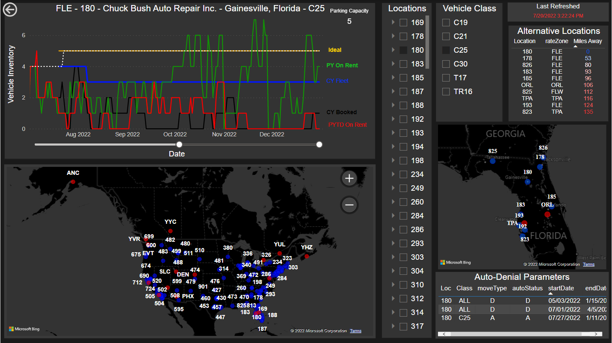
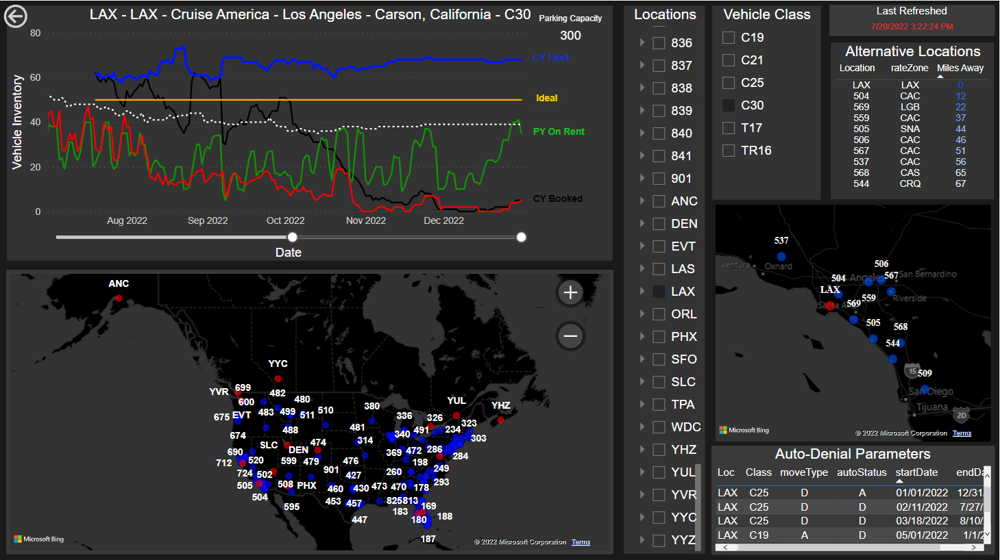

# Logistics Dashboard

## Security

Sensitive information including financial data and the Power BI file itself was not included in this repository for the protection of company data.

## Software

- Power BI
- Microsoft SQL Server

## Purpose

The logistics dashboard was created to better manage the operations fleet among the 140+ locations. Previously, logistics decisions were made upon static snapshots generated from outdated software on a daily basis. The main issue with this was same-day vehicle reservations were not reflected in the snapshots until the next day; this caused overbooking. The company decided to migrate the data and utilize Microsoft SQL Server and Power BI to generate fleet data in real time.

## Dashboard

The logistics dashboard generates fleet graphs using the location and vehicle class for the desired reservation. The graph displays fleet metrics used to approve/deny reservation requests. There are two maps used on this dashboard to circumvent the limitations in PowerBI:

1. The smaller map on the right displays the 10 nearest locations to the selected venue. This is used to offer alternative routes in instances where locations cannot accomodate the loss of a vehicle.

2. The larger map in the bottom-left utilizes Power BI Tooltips to pull-up fleet graphs by hovering over a location on the map. This allows for the logistics manager to comb through multiple locations' fleet inventories quickly.

Lastly, there is a refresh guide to notify users of the last recent update. Updates are scheduled and published hourly for more accuracte logistics decisions.

