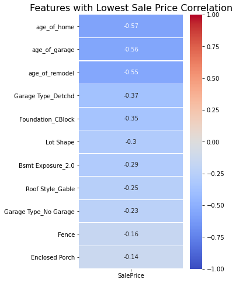

# Modeling Housing Prices in Ames, Iowa
##### Author: Michael Riedeman

---

### Problem Statement

This project seeks to maximize the accuracy of predicting the price of a house at sale utilzing linear regression modeling strategies. Success of the model will be evaluated by comparing the training MSE, RMSE and R-squared  scores against the baseline model (average sale price and Null MSE). The data collected includes 81 features that describe different aspects of a given home. The homes are all located in Ames, Iowa; a small city that resides in the middle of the state. This model can be used in the cities' local real estate market as a supplementary price estimation tool.

### Data Description
---

 

 

 

### Data Dictionary
---

The dataset used to create the model was obtained from Kaggle ([*source*](https://www.kaggle.com/c/dsir-524-project-2-regression-challenge/data)). For brevity, only the features used in the final model will be listed in the table below. Descriptions of the remaining data can be found in the link to the dataset (above).

|               |    **Data Dictionary for the Final Model**                     |
|:--------------|:---------------------------------------------------------------|
| Overall Qual  | Rates the overall material and finish of the house (Ordinal)   |
| Exter Qual    | Evaluates the quality of the material on the exterior(Ordinal) |
| Gr Liv Area   | Above grade froundliving area in square feet (Continuous)      |
| Kitchen Qual  | Kitchen Quality (Ordinal)                                      |
| Garage Area   | Size of garage in square feet (Continuous)                     |
| Garage Cars   | Size of garage in car capacity (discrete)                      |
| Total Bsmt SF | Total square feet of basement area (Continuous)                |
| 1st Flr SF    | First Floor square feet (Continuous)                           |
| Bsmt Qual     | Evaluates the height of the basement (Ordinal)                 |
| Garage Finish | Interior finish of the garage (Ordinal)                        |

### Model Performance and Primary Findings

---
    
Four models were created in attempts to model sale price from the housing data. The baseline model was $180,904 with a Null MSE of 6,255,753,308. The first model was a simple linear regression fit with no feature transformations or scaling. After one-hot encoding the 12 categorical variables that had a matching number of feature subcatagories between the training and test datasets, there was a total of 107 features inputted to the model to predict sale price. The model was biased towards test data as there was often a difference in train and test R-squared scores greater than 10%. The next model attempted to mitigate the high variance through standard scaler and lasso cross-validation techniques. 

The second model included the same inputs as the first, but this time the numeric data was scaled utilizing the standardscaler to convert numbers to z-scores accounting for the various number ranges. Lasso technique was chosen over Ridge in attempts to minimize the categorical data that offered little contribution to the linear model. Still, however, results continued to be overfit with R_squared scores only slightly improving depending on the data analyzed from a given train-test-split iteration. It was clear that features needed to be removed that did not meaningfully predict sale price. 

In the third model, all features were removed except for the 10 features most correlated with sale price. This was an agressive change in the modeling procedure that was used to understand the contributions of categorical data. It should be noted that none of the categorical data was used in the third iteration of the model. Data types of the features were either ordinal data specifying quality or continuous data specifiying the size of a garage, floor, room, etc. Data was scaled with standard scaler and the Ridge cross-validation regression method was implemented. The model decreased its variance relative to previous models, but this time the model was underfit. Feature engineering needed to be implented to discover feature interactions that provided better correlations to sale price than the existing features.

The fourth model uses the third model's inputs, but this time applies polynomial features to the inputs before scaling and running Ridge cross-validation. Here we witness some success as the R-squared difference between training and testing data was only 2 % with and R-squared score of 0.88. The average error in predicting sale price (RMSE) was roughly 
30,000 on the training data and 34,000 on the testing data. 
    

### Conclusions
---

Overall, 88% of the variability in sale price can be explained by the features in the model.  The categorical data types would likely be more effective if the ratio of rows to columns wasn't so low. This could possibly be improved by slowly adding catagorical features to increase the R-squared score, but remove them if the feature introduces too much variance. The coefficients that increased sale price the most were all feature interactions. The feature interaction improved the models bias and eradicated a majority of the variance. 

### Recommendations
---

This model would benefit from log transformations on the non-linear features to them to normal distributions. It is recommended this model only be used on homes in Ames, Iowa that are less than $300,000 as the model does not predict high priced homes well. The outliers were all high priced homes, and removing these could significantly improve the model because it would no longer account for these instances. 

### Sources
---

1. Kaggle Dataset 

https://www.kaggle.com/c/dsir-524-project-2-regression-challenge/data

