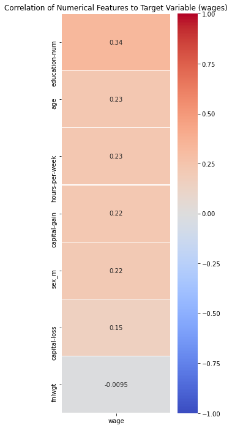
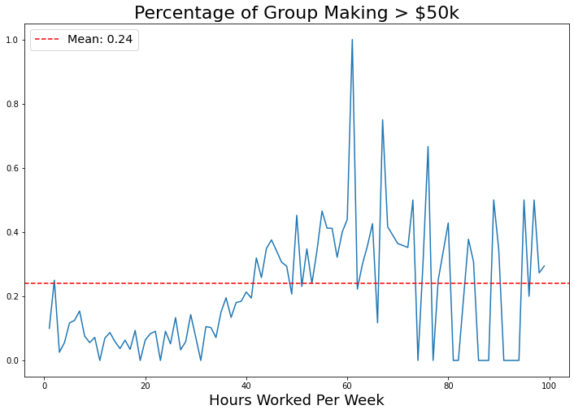
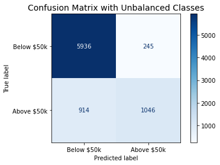
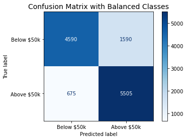

# Predicting Income with Random Forest
##### Author: Garrett Hart and Michael Riedeman

---

### Problem Statement

Data from the 1994 United States Census Bureau database was collected to estimate whether a person makes over $50,000 dollars annually. A Random Forest binary classifaction model was trained on 13 socio-econmic features describing the 32,561 people surveyed. This analysis seeks to identify the most impactful socio-economic features on incomes for American citizens.

### Data Description
---

 

 

### Data Dictionary
---

The dataset used to create the model were obtained from Kaggle. ([*source*](https://www.kaggle.com/uciml/adult-census-income/discussion/32698))

|  **Data Dictionary**             |                                                                                                                             |
|:---------------|:-----------------------------------------------------------------------------------------------------------|
| age            | The age of the person sampled                                                                              |
| workclass      | Evaluates the quality of the material on the exterior(Ordinal)                                             |
| fnlwgt         | The weighted tally indicated likeness in socio-economic and demographic statistics                        |
| education      | The highest level of education the person sampled achieved.(categorical)                                   |
| education-num  | The highest level of education the person sampled achieved, ranked on a numbered scale (ordinal)           |
| marital-status | The marital status of the person sampled                                                                   |
| occupation     | The job sector the person sampled works                                                                    |
| relationship   | The relationship of the person sampled to the data given in the sample.                                    |
| sex            | The gender of the person sampled                                                                           |
| capital-gain   | Capital gains for the person sampled in dollars                                                            |
| capital-loss   | Capital losses for the person sampled in dollars                                                           |
| hours-per-week | The average hours per week the person sampled works                                                        |
| native-country | The country of origin for the person sampled                                                               |
| wage           | Binary outcome indicating whether the annual income for the person sampled was above or below 50k dollars |
### Model Performance and Primary Findings

---
    
13 features were used to train the Random Forest model, with seven features being one-hot-encoded to translate the categorical test strings into numeric data. GridSearch was utilized to find the optimal hyperparameters:

- n_estimators:      *2000*
- max_features:      *sqrt*
- max_depth:        *10*
- min_samples_split: *2*
- min_samples_leaf:  *4*
- ccp_alpha:         *0.0005*

Model accuracy for the optimized model was 85.6% and 85.7% for the training and testing data respectively. This indicates a relatively strong model performance with minimized variance and low bias. The model reported a 9.8% improvement over the baseline score (75.9%).

### Conclusions
---

Overall, the model boosted the classification accuracy of the training data by 9.8% over the baseline model. When introduced to the unknown test data, the model had a classification accuracy of 94.0% on the test data when trained on unbootstrapped training data, and 79.9% accuracy when trained on bootstrapped data. It was believed bootstrapping would increase the model's accuracy, however in this scenario this was not the case.

### Recommendations
---
With a 94.0% accuracy on the test data, it is recommended the model trained on the unbootst1rapped data be used to classify whether a citizen's income is greater than $50,000. To improve the model, additional features could collected such as:

- subject of degree
- zipcode
- number of children
- credit score
- disability (y/n)

### Sources
---

1. Dataset from Kaggle: ([*source*](https://www.kaggle.com/uciml/adult-census-income/discussion/32698)). 

