# Modeling Pitch Quality in Major League Baseball

Author: Michael Riedeman

---

### What's in this repository

|Folder|Content|
|---|---|
|code| A functions.py file with all the functions required for preprocessing, modeling, analysis, and creating strike zone plots. A Jupyter notebook to run the functions in an established order to demonstrate the workflow.
|data|CSV files with Statcast data collected from Baseball Savant and .pkl files with saved versions of the model|
|presentation_images|images displayed in this README.md file|
|slides|Presentation slides|

---

### Background and Problem Statement

Baseball has always been a sport rich in statistical analysis, and the advent of machine learning applications has taken this a step further. Since 2015, all 30 stadiums have Statcast technology installed in their ball parks, allowing for player/ball movement to be monitored using high definition video and doppler radar. With large amounts of player/ball movement data being stored, this technology has allowed for machine learning models to identify trends and give players an edge on the field. Statcast has already created an impact on the game as hitters adjust their launch angles and pitchers adjust their mechanics by reviewing data on their individual player data. Now, baseball analysts seek to solve more complicated problems like pitch sequence optimization. This project tackles the first step in pitch sequence optimization by first modeling pitch quality to gain insight on the quality of different pitches in different scenarios. 

---

### Data collection

Statcast data was collected utilzing the pybaseball python library, which scrapes Statcast data from baseball savant. The data dictionary for the Statcast data can be found [here](https://baseballsavant.mlb.com/csv-docs). 

---

### Preprocessing
After dropping incomplete data and pitches with low data volume, pitch quality was modeled utilizing over 1.5 million pitches and 699 pitchers spanning from 2018-2021. Pitches evaluated in this report were those with the most data:

- Four Seam Fastablls
- Curvballs
- Sliders

#### Train-validation split

A standard 75/25 was used to split the training and testing data respectively. 

---

### Pitch Quality Model

Predicting pitch quality can be especially difficult given the randomness of player tendencies, size, and strength from both the pitcher and batter's perspective. Additionally, the game situation can also influence the quality of a pitch due to how decisions change and the overall pressure place upon the players. Given this, a popular method for predicting the outcome of pitches is the run expectancy matrix (re24). The re24 predicts the expected number of runs scored given the situation. For example, with runners on first and third with 1 out the re24 predicts that 1.140 runs will be scored in the half inning of play. By taking the change in run expectancy after a pitch is thrown the quality of the pitch can be measured. 

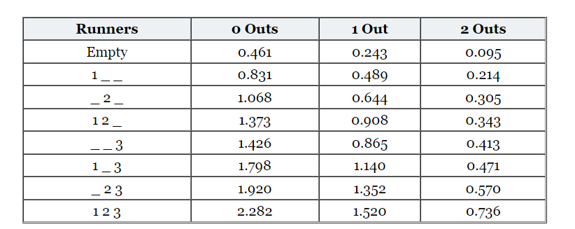

But wait, not every pitch results in an outcome (hit, strikeout, etc.). What about changes in the hitter's count? Does the run expectancy change as the counts changes from a 1-1 count to a 3-2 count? The answer for both questions is yes, and it can be accounted for with empirically calculated average impact given the change in the pitch-count. These are often called linear weights and the values for each count can be viewed in the table below.

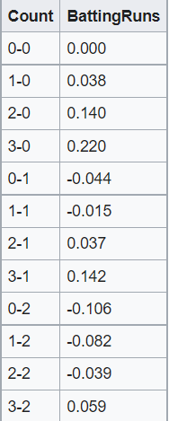

Utilizing both the re24 matrix and the pitch-count linear weights, the delta run expectancy can be calculated for virtually every situation and becomes the target variable for the model.

A Random Forest regression model was used to predict the change in expected runs using the following parameters:

1. pitcher handedness
2. batter handedness
3. horizontal pitch location
4. vertical pitch location
5. horizontal movement
6. vertical movement
7. veloctiy
8. spin rate
9. pitch count (balls and strikes)
10. type of pitch (Fastball, Curveball, etc.)

---

### Results

In this problem, the **baseline RMSE score was .24 delta expected runs**. A gridsearch was applied to the random forest model to optimize for the best features. This was very time consuming as models often ran for over 24 hours.

After several attempts and fine-tunings of various models, the best performing model yielded an MSE of **0.238 delta expected runs**. This was only a marginal increase in the baseline model and is evident with the average five-fold cross validation **test R^2 score of .018834**. Only 1.8% of the delta run expectancy can be described by the features in the model.

Regardless of the model's results, scatterplots of the strike zone were plotted with a color scale on delta run expectancy to analyze different pitch types and counts given the situation. Below are plots for four-seam fastballs, curveballs, and sliders in different counts. 

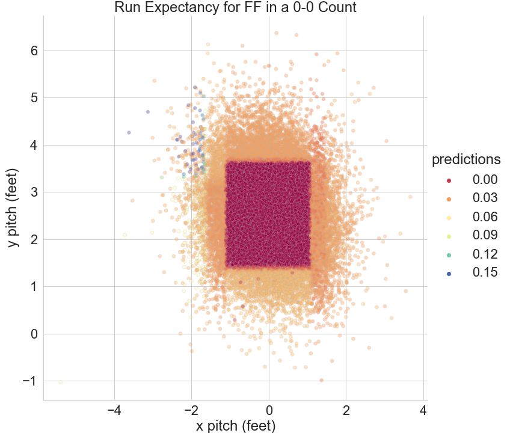

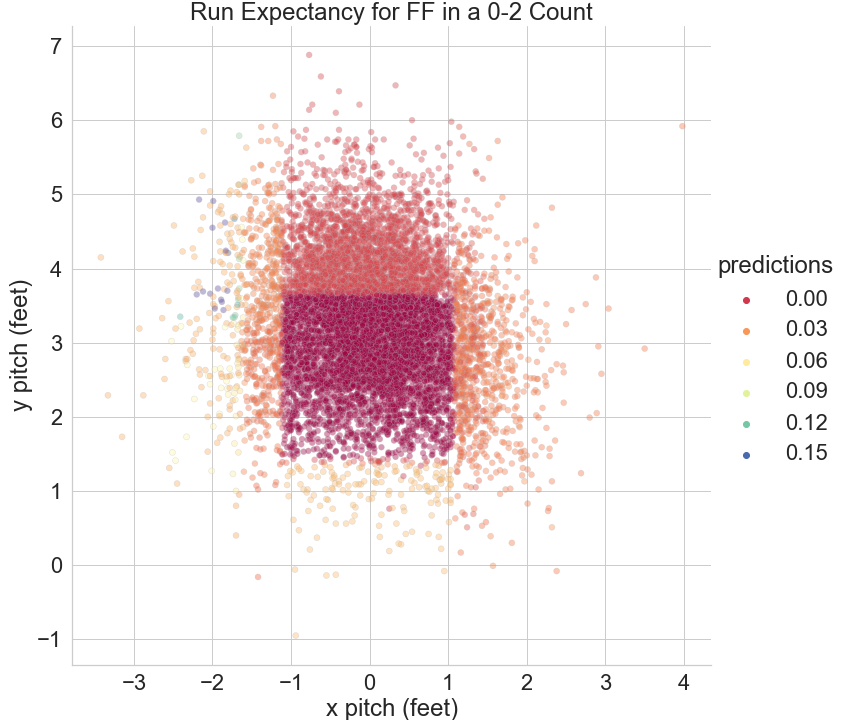

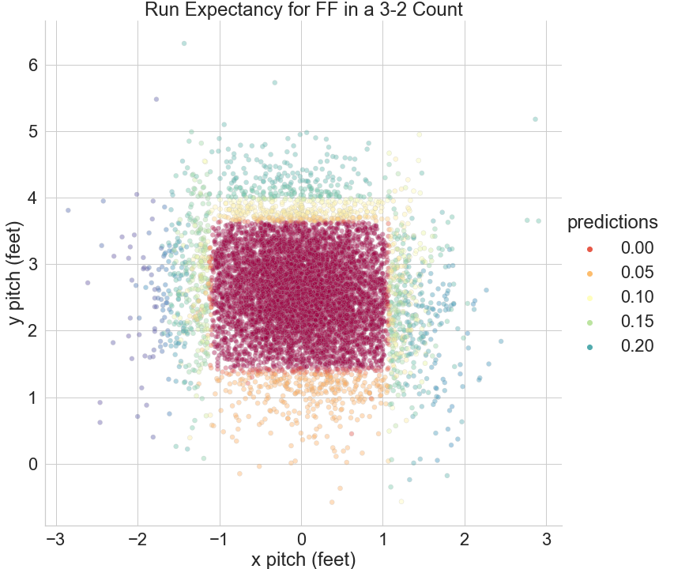

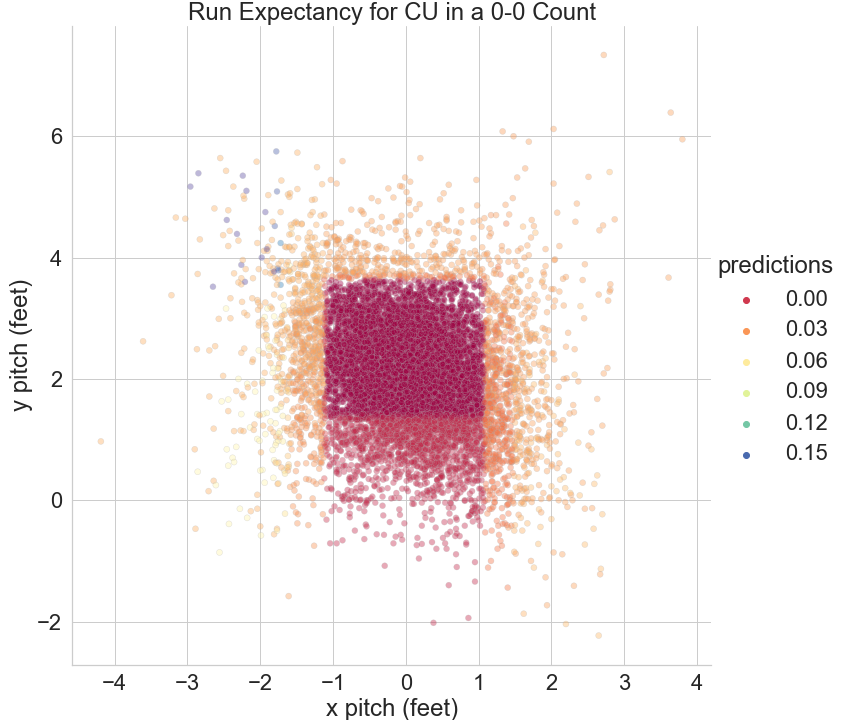

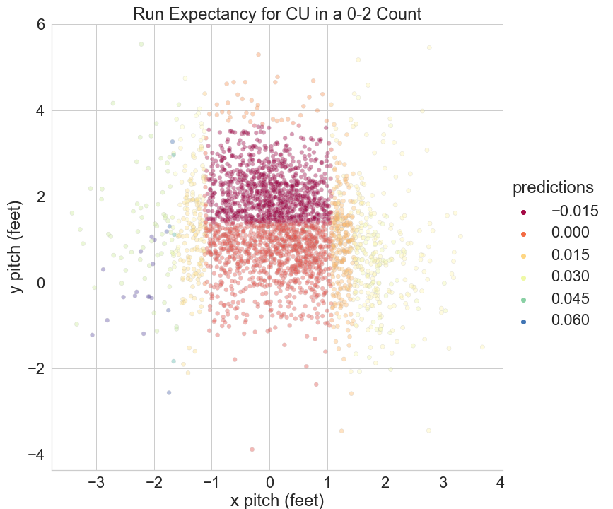

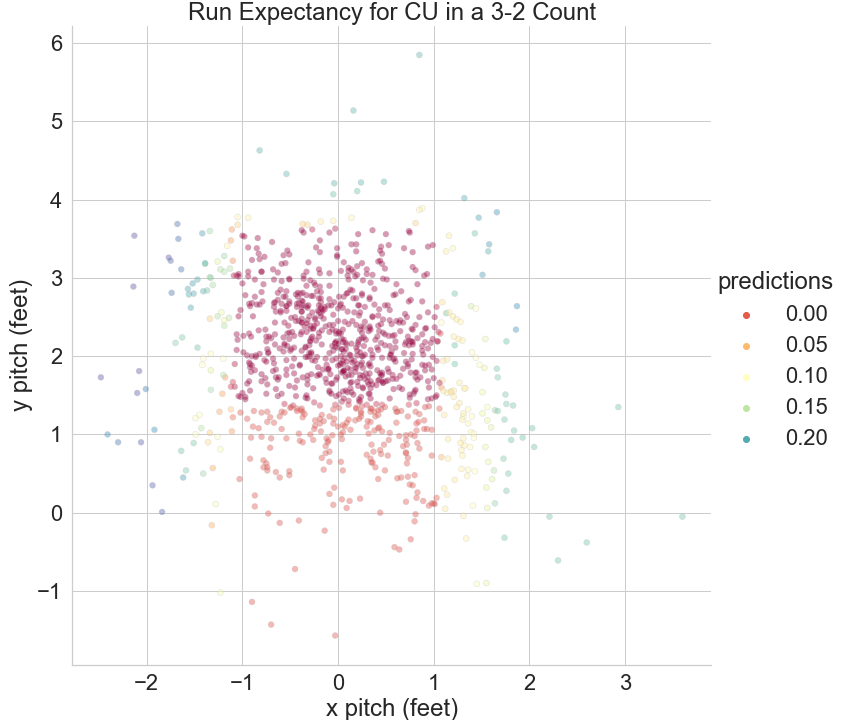

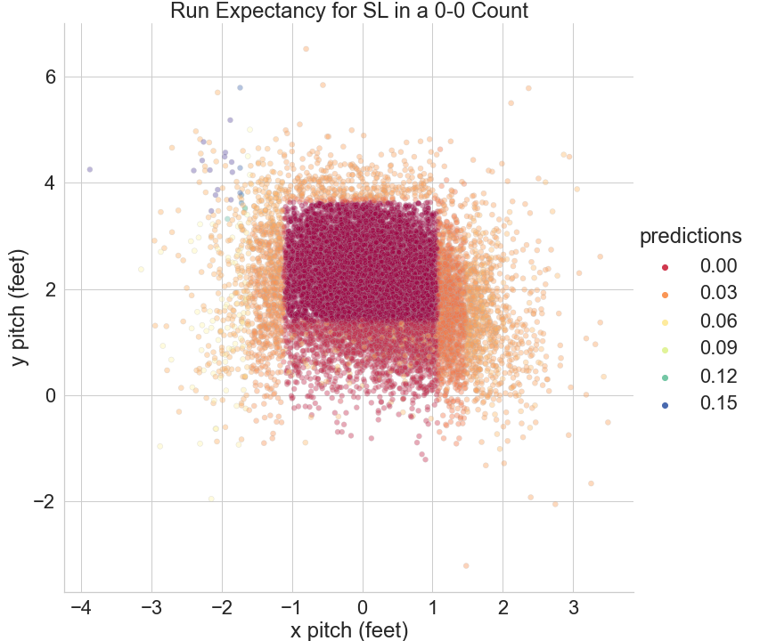

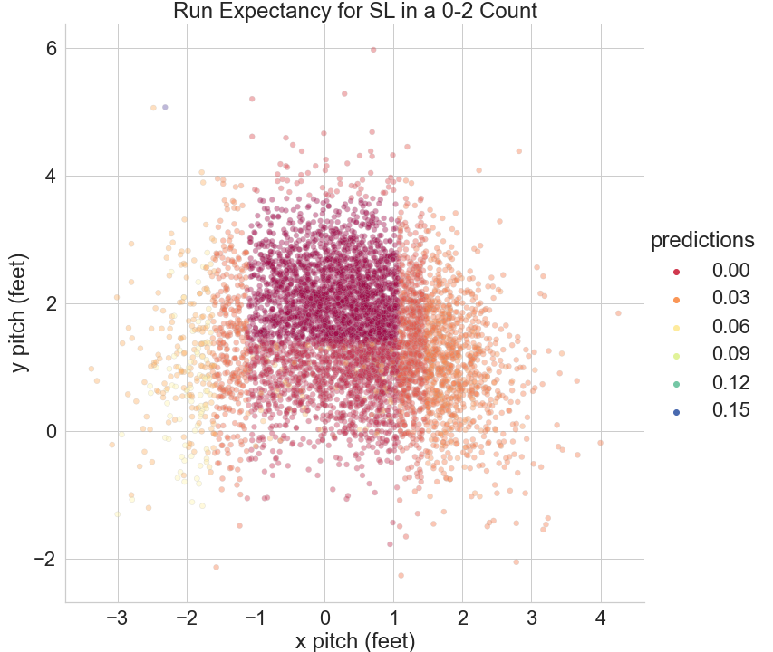

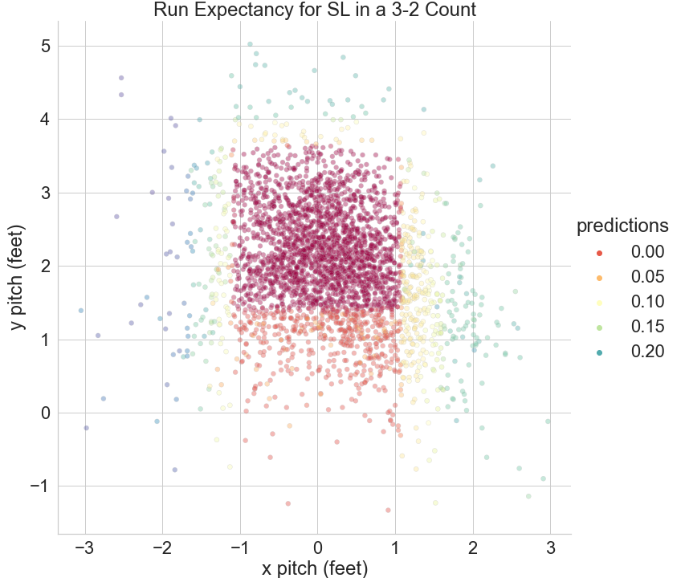

--

### Conclusions

The results were surprising. It was predicted that the model would perfrom far better in predicting results because features such as horizontal/vertical break would assist in predicting balls out of the zone (chase breaking balls would be predicted as a lowered run expectancy even though the ball is out of the zone). The model instead relies heavily on the location of the pitch. 

Four-seam fastballs in an 0-0 count predict a negative run expectancy as long as the ball is strike. It was predicted that balls closer to the middle of the zone would have a slightly positive run expectancy because they are more hittable pitches. This can be observed on 0-2 fastballs where pitches outside the zone have different predictions than the 0-2 fastball. Fastballs up have a slightly higher run expectancy than pitches in the strike zone. Pitchers often throw high fastballs in 0-2 counts to go for the strikeout, but the model actual predicts this choice as slightly less favorable than just throwing in the zone. However, 0-2 fasbtalls that are inside, outside, or low have higher run expectancies. This suggests 0-2 high fastballs are more effective than other locations outside of the zone. 3-2 Fastballs indicate the opposite effect, where the optimal location is at the bottom of the zone.

Like fastballs, breaking pitches such as sliders and curveballs had the lowest run expectancy as long as they were in the zone, but run expectancy was slightly higher with pitches lower in the zone. This was the opposite of what was expected. Pitchers are told to keep breaking pitches down to avoid leaving a hanging breaking pitch over the plate. The increase in run expectancy is likely higher for lower breaking pitches because when the pitch is ruled a ball the run expectancy increases. 

 
---

### Sources

1. [Pitch quantification of linear weights](https://en.wikipedia.org/wiki/Pitch_quantification)

2. [wOBA seasonal constants](https://library.fangraphs.com/the-beginners-guide-to-deriving-woba/)

3. [pybaseball Library](https://github.com/jldbc/pybaseball/)

